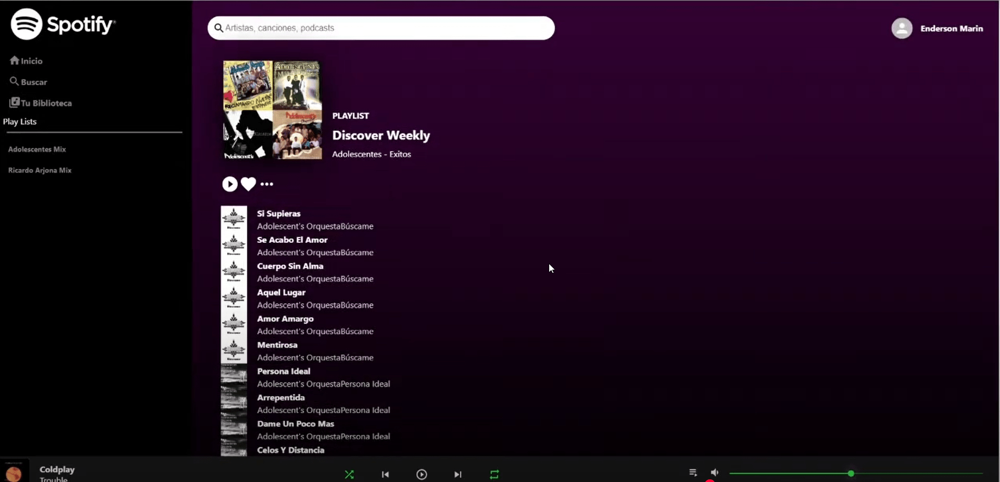
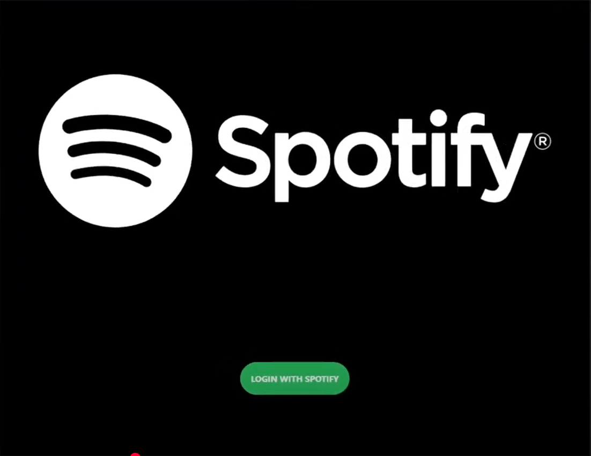
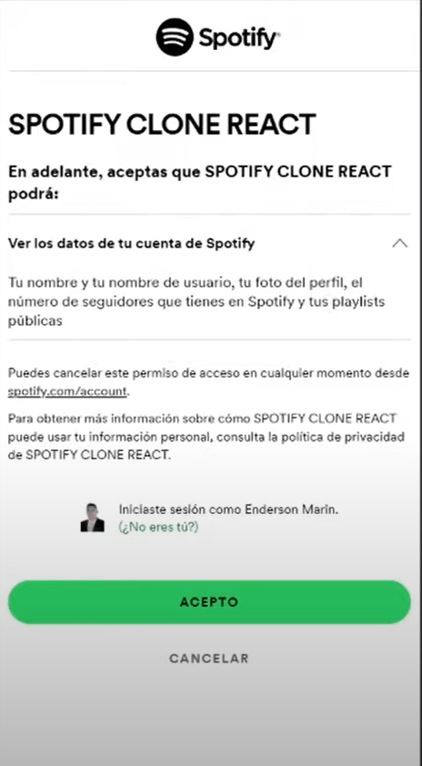

## Título do Projeto

<strong>Spotify Clone</strong>

## Descrição do Projeto

<p style="text-align: justify;">
  O Spotify Clon é uma aplicação web que simula um serviço de streaming de música, projetada para replicar a experiência do usuário de uma das maiores plataformas de áudio do mundo. O projeto se diferencia pela sua arquitetura de frontend robusta, gestão de estado escalável e, principalmente, pela integração direta com a API oficial do Spotify, o que permite uma experiência autêntica de navegação e reprodução de conteúdo musical.
</p>

## Funcionalidades-Chave:

- Integração com a API do Spotify: Permite buscar, descobrir e reproduzir músicas, álbuns e playlists diretamente da API oficial do Spotify, garantindo uma vasta biblioteca de conteúdo.

- Player de Música Completo: Oferece um player funcional com controles essenciais como reproduzir, pausar, avançar e retroceder faixas.

- Gestão de Estado Centralizada: Utiliza a arquitetura Redux para gerenciar o estado da aplicação de forma eficiente, garantindo que as informações do player, do usuário e das músicas estejam sincronizadas em toda a interface.

- Interface Dinâmica: Componentes de UI padronizados e alertas interativos, que proporcionam uma navegação fluida e uma experiência agradável ao usuário.

## Stack Tecnológica:

- Frontend: Construído com a biblioteca React, o projeto utiliza Redux Toolkit para uma gestão de estado previsível e organizada. A navegação entre as diferentes seções da aplicação é controlada pelo React Router DOM.

- Consumo de API: A comunicação com a API oficial do Spotify é realizada através da biblioteca spotify-web-api-js, que simplifica a busca e a manipulação dos dados musicais.

- Design e Componentes: A interface é estilizada de forma modular e profissional usando Styled Components, e se beneficia da vasta biblioteca de componentes Material-UI para um visual consistente.

- Testes: Inclui bibliotecas como Jest e React Testing Library, demonstrando um compromisso com a qualidade e a estabilidade do código.

## Capturas de Tela

<div style="display: flex; width: 100%;">
  <div style="width: 100%;"></div>
</div>

<div style="display: flex; width: 100%;">
    <div style="width: 70%;"></div>
    <div style="width: 30%;"></div>
</div>

## Começando

### Pré-requisitos

Você precisa instalar o seguinte software

1.  NODEJS(VERSION: 20.10.0)
2.  NPM(VERSION: 10.2.3)
3.  GIT

### A maneira mais fácil para começar é clonar o repositório:

git clone [https://github.com/ENDERSON-MARIN/SPOTIFY-CLON](https://github.com/ENDERSON-MARIN/SPOTIFY-CLON)

### Mude o diretório e abra no editor de texto

- cd your-project-directory
- open in your text editor

### Configure suas variáveis de ambiente (Clone o arquivo .env.template e renomeie para .env)

- REACT_APP_ENDPOINT = ""
- REACT_APP_CLIENTID = ""
- REACT_APP_REDIRECTURI = ""
- REACT_APP_PLAYLIST = ""

### Inicie seu aplicativo de forma muito simples

- Inicie o projeto no modo de desenvolvimento

```
npm run start
```

- Você pode verificar que o site estará funcionando em localhost
  http://localhost:3000

## Autor

- [Enderson Marín](https://www.marinenderson.com)

## Meu contato:

- 📧 Email: marinenderson1@gmail.com
- 🐱 GitHub: https://github.com/ENDERSON-MARIN
- 🌐 Portfolio: https://portfolio-ecmm.vercel.app/
- 💼 LinkedIn: https://www.linkedin.com/in/enderson-marin

## Vídeos de Demonstração

- Você pode verificar um vídeo de demonstração do meu projeto no seguinte canal:

  https://www.youtube.com/channel/UCDIIj706aFneZlfVJucVkhA

## Licença

Este projeto está licenciado sob a Licença MIT - consulte o arquivo [LICENSE.md](LICENSE.md) para obter detalhes
